

  
    
  
<strong>Sistema de gestión de consultas médicas con citas, pacientes, médicos, historial clínico y reportes</strong>

  
  
  
  
  
  
  
  

---

# Documentación CitaMed

Sistema de Gestion de Consultas Medicas - CitaMed

---

## 1. Landing Page

Pagina principal publica del sistema.

Hero:

.png)

Especialidades:

.png)

Doctor destacado:

.png)

Reserva de citas:

.png)

Consultas / FAQ:

.png)

Testimonios / Footer:

.png)

---

## 2. Login

Autenticacion de usuarios con JWT.

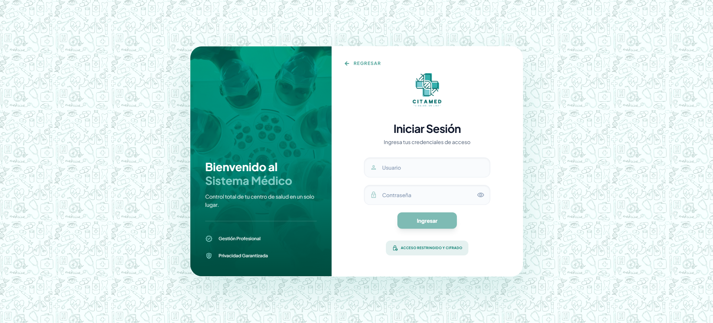

---

## 3. Dashboard

Vista principal con metricas del sistema.

Dashboard parte 1 - cards de estadisticas:

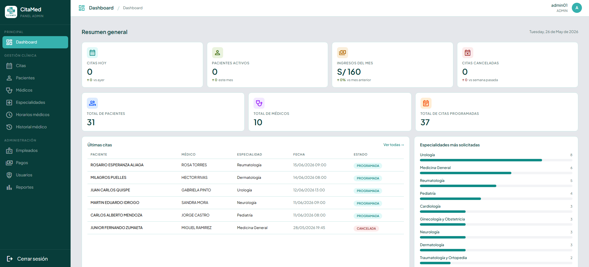

Dashboard parte 2 - ultimas citas, especialidades, agenda, medicos, pagos:

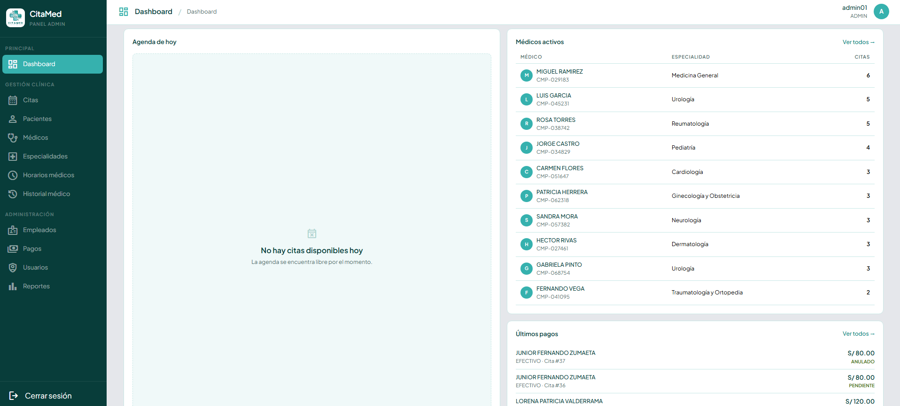

El dashboard muestra:
- Citas de hoy
- Pacientes activos del mes
- Ingresos del mes
- Citas canceladas de la semana
- Total de pacientes registrados
- Total de medicos registrados
- Total de citas programadas
- Ultimas citas registradas
- Especialidades mas solicitadas
- Agenda del dia
- Medicos activos (top por citas)
- Ultimos pagos

---

## 4. Gestion de Pacientes

CRUD completo de pacientes.

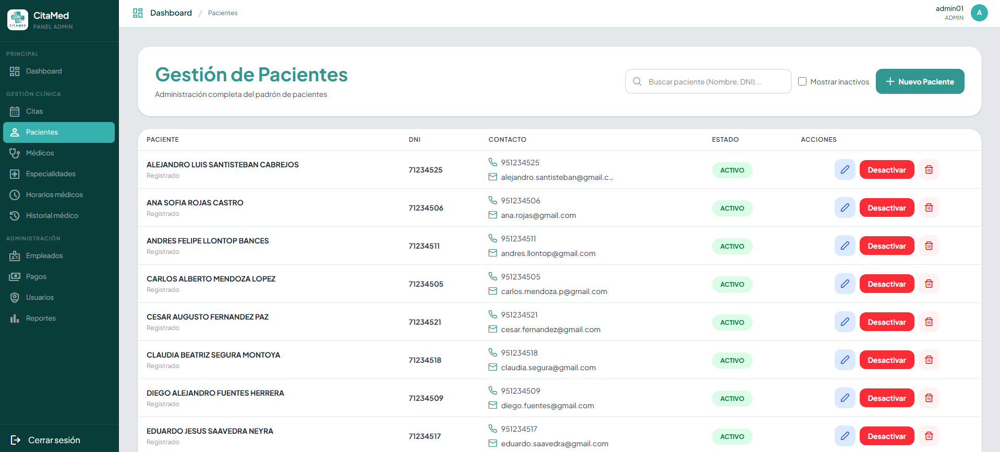

Funcionalidades:
- Listar pacientes con paginacion
- Buscar por nombre, apellido o DNI
- Incluir pacientes inactivos
- Registrar nuevo paciente
- Editar datos del paciente
- Eliminar (soft-delete) / Activar / Desactivar

---

## 5. Gestion de Medicos

CRUD completo de medicos.

Listado de medicos | Modal de registro / edición
:---:|:---:
.png) | .png)

Funcionalidades:
- Listar medicos con paginacion
- Buscar por nombre o DNI
- Filtrar por especialidad
- Registrar nuevo medico con foto
- Editar datos del medico (incluye foto)
- Cambiar especialidad
- Asignar consultorio
- Activar / Desactivar medico

---

## 6. Gestion de Especialidades

CRUD completo de especialidades.

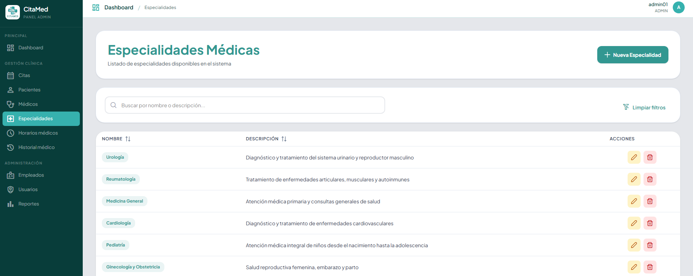

Modal de especialidad:

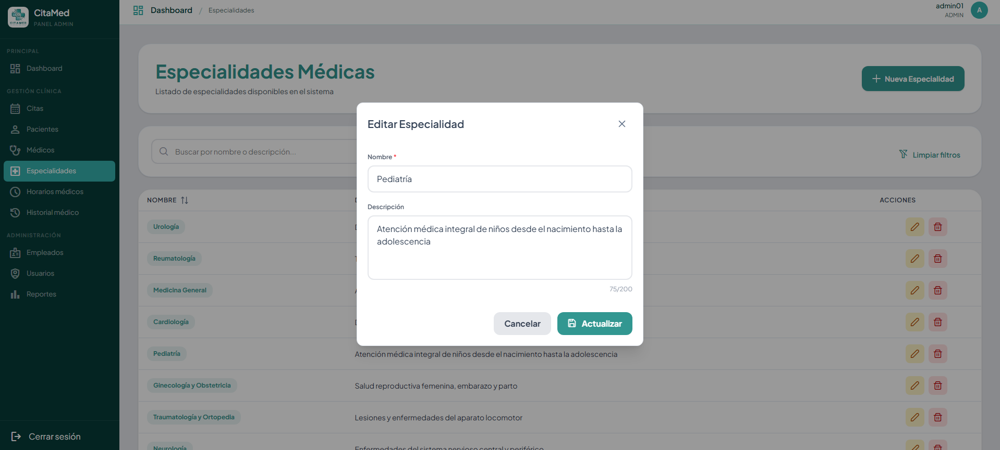

Funcionalidades:
- Listar especialidades con paginacion
- Buscar por nombre
- Registrar nueva especialidad
- Editar especialidad
- Activar / Desactivar especialidad

---

## 7. Gestion de Consultorios

CRUD completo de consultorios.

Listado de consultorios | Modal de registro / edicion
:---:|:---:
.png) | .png)

Funcionalidades:
- Listar consultorios con paginacion
- Buscar por nombre
- Filtrar por disponibilidad
- Registrar nuevo consultorio
- Editar consultorio
- Activar / Desactivar consultorio

---

## 8. Gestion de Citas

CRUD completo y operaciones de estado.

Listado de citas:

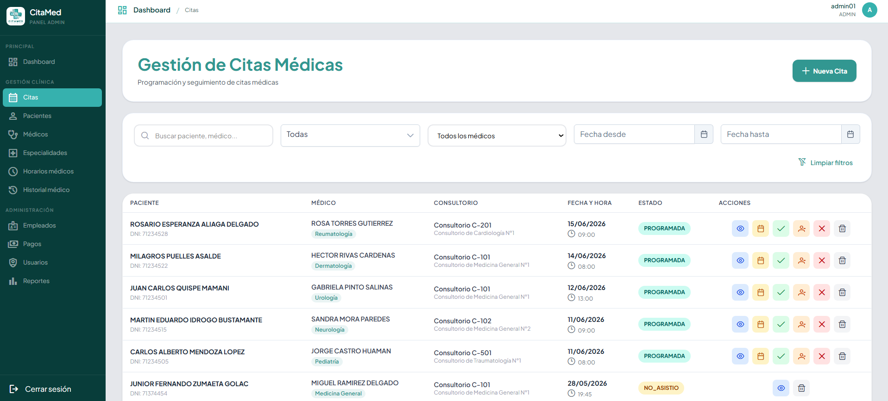

Detalle de cita:

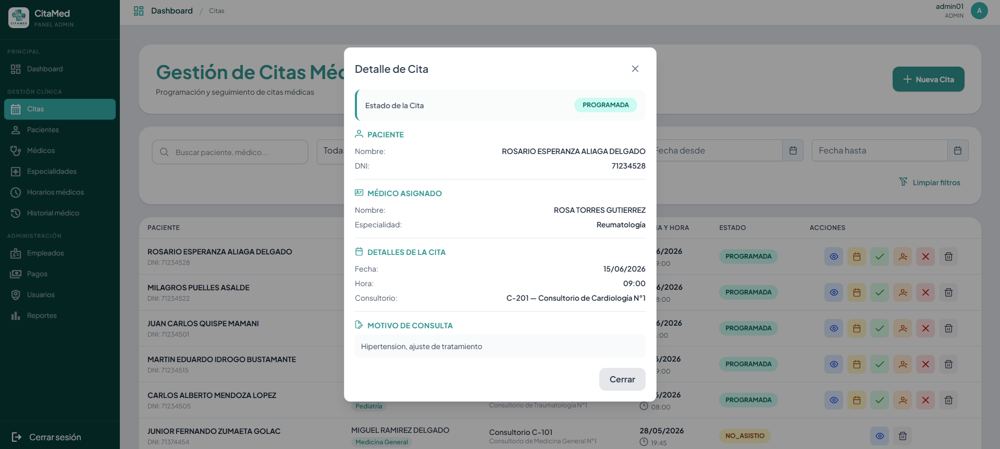

Informacion adicional:

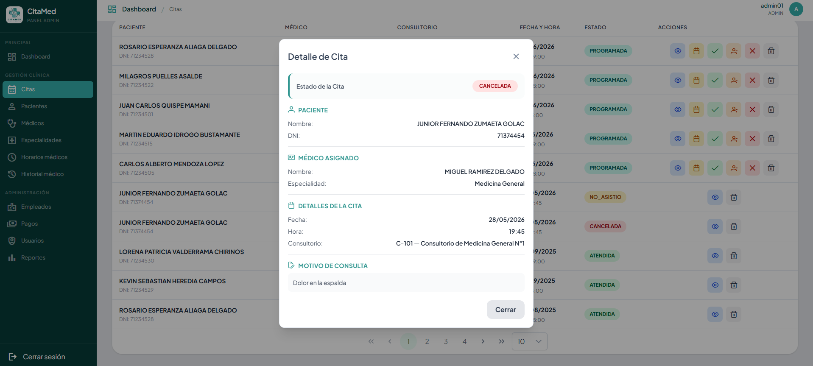

Funcionalidades:
- Listar citas con paginacion
- Buscar por paciente, medico o DNI
- Filtrar por estado y rango de fechas
- Crear cita (paciente + medico + fecha + consultorio)
- Ver detalle completo de la cita
- Cancelar cita
- Completar cita (marcar como atendida)
- Reprogramar cita
- Marcar como "no asistio"
- Eliminar cita

---

## 9. Gestion de Horarios

Administracion de horarios por medico.

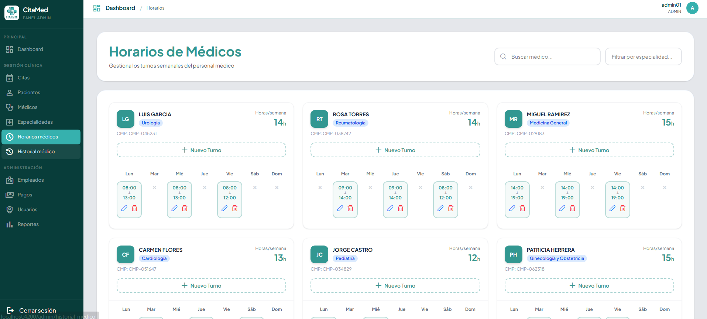

Funcionalidades:
- Listar horarios por medico
- Agregar horario (dia, hora inicio, hora fin, consultorio)
- Editar horario
- Activar / Desactivar horario

---

## 10. Historial Medico

Consulta del historial clinico completo de los pacientes, con descarga de PDF.

Listado de pacientes e historial:

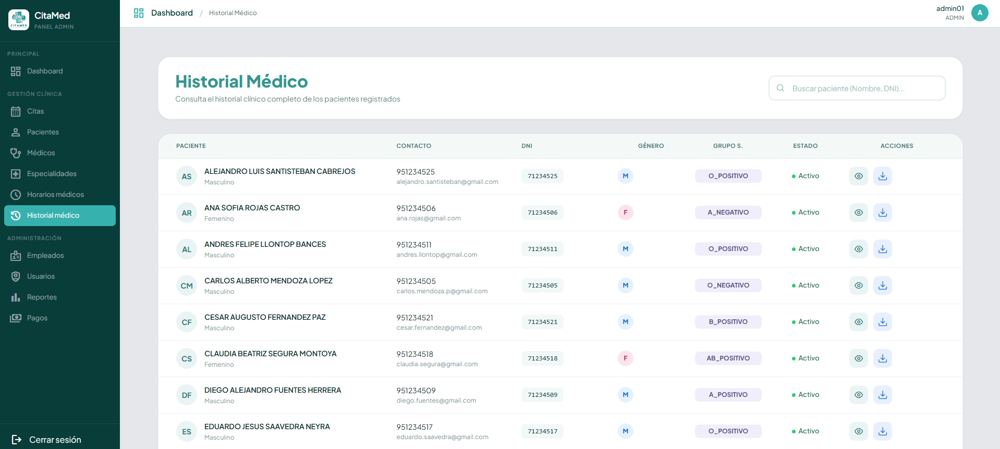

Modal con detalle de historial medico de cada paciente | PDF generado del historial medico
:---:|:---:
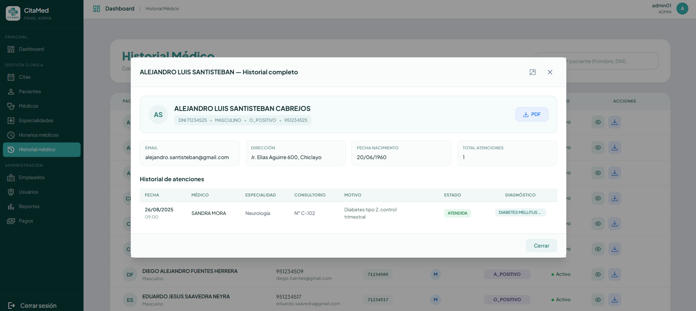 | 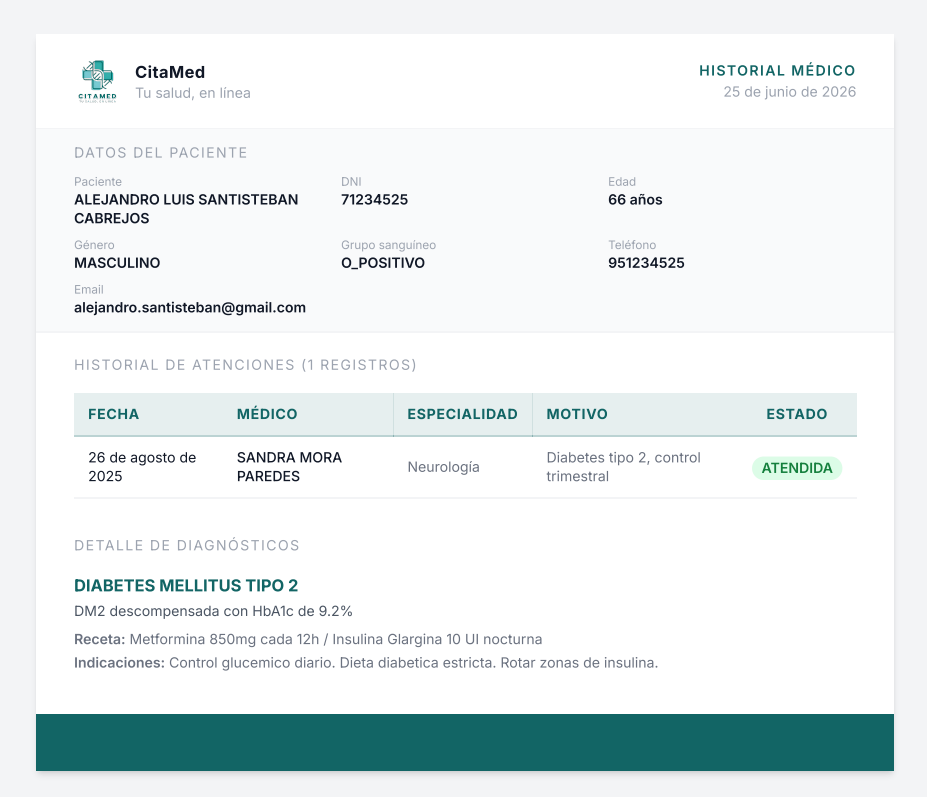

Funcionalidades:
- Listar pacientes con busqueda por nombre o DNI
- Ver historial completo (citas + diagnosticos) en modal
- Detalle de cada consulta con diagnostico, receta e indicaciones
- Descargar PDF del historial medico
- PDF se abre en nueva pestana con nombre estandarizado
- Acceso por roles ADMIN / MEDICO / RECEPCIONISTA
- Filtra solo pacientes del medico cuando el rol es MEDICO

---

## 11. Diagnósticos

Gestión de diagnósticos y recetas médicas asociados a las citas.

Listado de citas pendientes y atendidas:

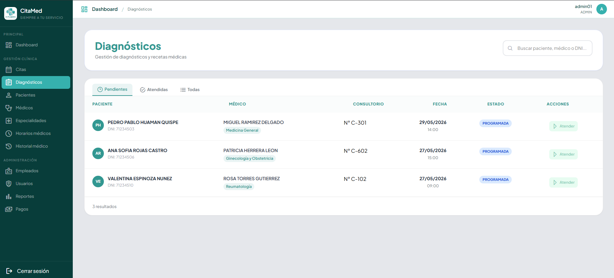

Modal de atención / edición | PDF de receta médica
:---:|:---:
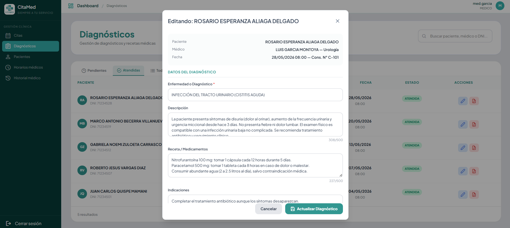 | 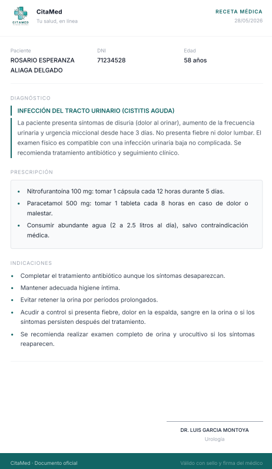

Funcionalidades:
- Listar citas pendientes y atendidas
- Filtrar por estado: Pendientes, Atendidas, Todas
- Buscar por paciente, médico o DNI
- Atender paciente: registrar enfermedad, descripción, receta e indicaciones
- Editar diagnóstico existente
- Descargar receta médica en PDF
- Acceso por roles ADMIN / MEDICO
- Validación de campos obligatorios (enfermedad)

---

## 12. Pagos

Gestión de pagos con generación de ticket PDF.

Listado de pagos | Modal de pago / ticket PDF
:---:|:---:
.png) | .png)

Funcionalidades:
- Listar pagos con paginación y ordenamiento
- Buscar por paciente o DNI
- Crear pago asociado a una cita
- Ver detalle del pago
- Descargar ticket PDF del pago
- Acceso por roles ADMIN / MEDICO / RECEPCIONISTA

---

## 13. Consultas

Bandeja de consultas enviadas desde la landing page, con gestión de respuestas vía email.

Listado de consultas:

.png)

Modal de detalle y respuesta:

.png)

Funcionalidades:
- Listar consultas recibidas con paginación y ordenamiento
- Indicador visual de no leído / leído / respondido
- Ver detalle de la consulta (marca automáticamente como leída)
- Responder consulta con envío de email al paciente
- Acceso por roles ADMIN / MEDICO / RECEPCIONISTA

---

## Resumen de Funcionalidades

| Modulo | Estado |
|--------|--------|
| Landing Page | Completo |
| Login / Autenticacion | JWT + roles |
| Dashboard | Metricas completas |
| Pacientes CRUD | Completo |
| Medicos CRUD | Completo |
| Especialidades CRUD | Completo |
| Consultorios CRUD | Completo |
| Citas CRUD | Completo (+ estados) |
| Horarios | Completo |
| Historial Medico | Completo (+ PDF) |
| Diagnosticos CRUD | Completo (+ Receta PDF) |
| Pagos CRUD | Completo (+ Ticket PDF) |
| Consultas | Completo (+ respuesta por email) |
| Seguridad | Roles ADMIN / MEDICO / RECEPCIONISTA |
| Backend API | Spring Boot + JPA + MySQL |
| Frontend | Angular + PrimeNG + Tailwind |
